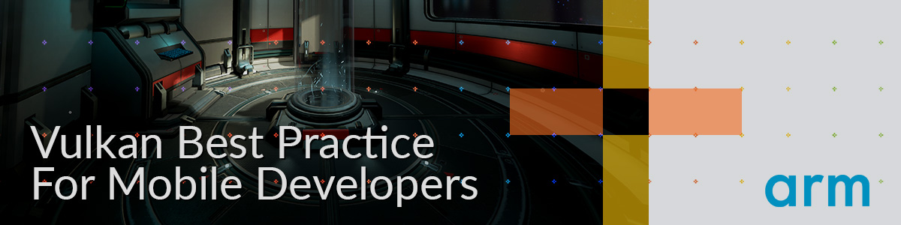

<!--
- Copyright (c) 2019, Arm Limited and Contributors
-
- SPDX-License-Identifier: MIT
-
- Permission is hereby granted, free of charge,
- to any person obtaining a copy of this software and associated documentation files (the "Software"),
- to deal in the Software without restriction, including without limitation the rights to
- use, copy, modify, merge, publish, distribute, sublicense, and/or sell copies of the Software,
- and to permit persons to whom the Software is furnished to do so, subject to the following conditions:
-
- The above copyright notice and this permission notice shall be included in all copies or substantial portions of the Software.
-
- THE SOFTWARE IS PROVIDED "AS IS", WITHOUT WARRANTY OF ANY KIND, EXPRESS OR IMPLIED,
- INCLUDING BUT NOT LIMITED TO THE WARRANTIES OF MERCHANTABILITY,
- FITNESS FOR A PARTICULAR PURPOSE AND NONINFRINGEMENT.
- IN NO EVENT SHALL THE AUTHORS OR COPYRIGHT HOLDERS BE LIABLE FOR ANY CLAIM, DAMAGES OR OTHER LIABILITY,
- WHETHER IN AN ACTION OF CONTRACT, TORT OR OTHERWISE, ARISING FROM,
- OUT OF OR IN CONNECTION WITH THE SOFTWARE OR THE USE OR OTHER DEALINGS IN THE SOFTWARE.
-
-->

# Vulkan Best Practice for Mobile Developers <!-- omit in toc -->



## Contents <!-- omit in toc -->

- [Introduction](#introduction)
  - [Goals](#goals)
- [Tutorials](#tutorials)
- [Setup](#setup)
- [Build](#build)
  - [Supported Platforms](#supported-platforms)
- [License](#license)
  - [Trademarks](#trademarks)
- [Contributions](#contributions)
- [Related resources](#related-resources)

## Introduction

The Vulkan Best Practice for Mobile Developers is collection of resources to help you develop optimized Vulkan applications for mobile platforms.

### Goals
- Create a collection of resources that demonstrate best-practice recommendations in Vulkan
- Create tutorials that explain the implementation of best-practices and include performance analysis guides
- Create a framework that can be used as reference material and also as a sandbox for advanced experimentation with Vulkan

> **Disclaimer:** This project covers advanced Vulkan concepts. If you are new to Vulkan here are a few links to get you started:
> - [Beginners Guide to Vulkan](https://www.khronos.org/blog/beginners-guide-to-vulkan)
> - [Get Started in Vulkan](https://vulkan-tutorial.com/)

## Tutorials
- **General**
  - [Controls](./docs/controls.md)
  - [Create a Sample](./docs/create_sample.md)
- **Vulkan Essentials**  
  - [How does Vulkan compare to OpenGL ES? What should you expect when targeting Vulkan?](./samples/vulkan_basics.md)
- **Vulkan Swapchains**  
More detailed look at swapchains, and how you might want to use them
  - [Appropriate use of N-buffering](./samples/advanced/swapchain_images/swapchain_images_tutorial.md)
  - [Appropriate use of surface rotation](./samples/advanced/surface_rotation/surface_rotation_tutorial.md)
- **Pipelines**
  - [Use of pipeline caches to avoid startup latency](./samples/advanced/pipeline_cache/pipeline_cache_tutorial.md)
- **Render Passes**
  - [Appropriate use of load/store operations, and use of transient attachments](./samples/advanced/render_passes/render_passes_tutorial.md)
- **AFBC**
  - [Appropriate use of AFBC](./samples/advanced/afbc/afbc_tutorial.md)

## Setup

Clone the repo with submodules using the following command:

```
git clone --recurse-submodules https://github.com/ARM-software/vulkan_best_practice_for_mobile_developers.git
cd vulkan_best_practice_for_mobile_developers
```

Follow build instructions for your platform below.

## Build

### Supported Platforms
- Windows - [Build Guide](./docs/build.md#windows "Windows Build Guide")
- Linux - [Build Guide](./docs/build.md#linux "Linux Build Guide")
- Mac OSX - [Build Guide](./docs/build.md#mac "Mac OSX Build Guide")
- Android - [Build Guide](./docs/build.md#android "Android Build Guide")

> Tested on: Samsung Galaxy S9, Samsung Galaxy S10, Huawei Mate 20 Pro, OPPO R15

## Testing

- System Test - [Usage Guide](docs/testing.md#system-test "System Test Guide")


## License

See [LICENSE](LICENSE).

This project has some third-party dependencies, each of which may have independent licensing:

- [astc-encoder](https://github.com/ARM-software/astc-encoder): ASTC Evaluation Codec
- [glfw](https://github.com/glfw/glfw): A multi-platform library for OpenGL, OpenGL ES, Vulkan, window and input
- [glm](https://github.com/g-truc/glm): OpenGL Mathematics
- [glslang](https://github.com/KhronosGroup/glslang): Shader front end and validator
- [dear imgui](https://github.com/ocornut/imgui): Immediate Mode Graphical User Interface
  - [dear imgui shaders](https://github.com/SaschaWillems/Vulkan/tree/master/data/shaders/imgui): GLSL shaders for dear imgui
- [HWCPipe](https://github.com/ARM-software/HWCPipe): Interface to mobile Hardware Counters
- [KTX-Software](https://github.com/KhronosGroup/KTX-Software): Khronos Texture Library and Tools
- [spdlog](https://github.com/gabime/spdlog): Fast C++ logging library
- [SPIRV-Cross](https://github.com/KhronosGroup/SPIRV-Cross): Parses and converts SPIR-V to other shader languages
- [stb](https://github.com/nothings/stb): Single-file public domain (or MIT licensed) libraries
- [tinygltf](https://github.com/syoyo/tinygltf): Header only C++11 tiny glTF 2.0 library
- [vma](https://github.com/GPUOpen-LibrariesAndSDKs/VulkanMemoryAllocator): Vulkan Memory Allocator
- [volk](https://github.com/zeux/volk): Meta loader for Vulkan API
- [vulkan](https://github.com/KhronosGroup/Vulkan-Docs): Sources for the formal documentation of the Vulkan API

This project uses the following 3D models. Each one has its own licence.

- Sponza [license](https://creativecommons.org/licenses/by/3.0/) with the following modifications:
   - All textures are converted to ASTC in .ktx format.
   - Converted to gltf using [Blender exporter](https://github.com/KhronosGroup/glTF-Blender-IO).

Models downloaded from Morgan McGuire's [Computer Graphics Archive](https://casual-effects.com/data).

Fonts downloaded from [Google Fonts](https://fonts.google.com), under license [Apache 2.0](http://www.apache.org/licenses/LICENSE-2.0)

### Trademarks

Vulkan is a registered trademark of the Khronos Group Inc.

## Contributions

All contributions are accepted under the same [LICENSE](LICENSE).

## Related resources

- [Mali GPU Best Practices](https://developer.arm.com/solutions/graphics/developer-guides/mali-gpu-best-practices): A document with recommendations for efficient API usage
- [PerfDoc](https://github.com/ARM-software/perfdoc): A Vulkan layer which aims to validate applications against Mali GPU Best Practices
