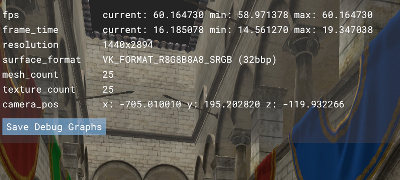

<!--
- Copyright (c) 2019, Arm Limited and Contributors
-
- SPDX-License-Identifier: MIT
-
- Permission is hereby granted, free of charge,
- to any person obtaining a copy of this software and associated documentation files (the "Software"),
- to deal in the Software without restriction, including without limitation the rights to
- use, copy, modify, merge, publish, distribute, sublicense, and/or sell copies of the Software,
- and to permit persons to whom the Software is furnished to do so, subject to the following conditions:
-
- The above copyright notice and this permission notice shall be included in all copies or substantial portions of the Software.
-
- THE SOFTWARE IS PROVIDED "AS IS", WITHOUT WARRANTY OF ANY KIND, EXPRESS OR IMPLIED,
- INCLUDING BUT NOT LIMITED TO THE WARRANTIES OF MERCHANTABILITY,
- FITNESS FOR A PARTICULAR PURPOSE AND NONINFRINGEMENT.
- IN NO EVENT SHALL THE AUTHORS OR COPYRIGHT HOLDERS BE LIABLE FOR ANY CLAIM, DAMAGES OR OTHER LIABILITY,
- WHETHER IN AN ACTION OF CONTRACT, TORT OR OTHERWISE, ARISING FROM,
- OUT OF OR IN CONNECTION WITH THE SOFTWARE OR THE USE OR OTHER DEALINGS IN THE SOFTWARE.
-
-->

# Controls

| Action                   |                     Desktop                     |               Mobile               |
| :----------------------- | :---------------------------------------------: | :--------------------------------: |
| Move around the scene    |                 <kbd>WASD</kbd>                 | <kbd>press</kbd> + <kbd>hold</kbd> |
| Rotate camera            | <kbd>right mouse button</kbd> + <kbd>drag</kbd> | <kbd>press</kbd> + <kbd>move</kbd> |
| Pan                      | <kbd>left mouse button</kbd> + <kbd>drag</kbd>  |                 -                  |
| Movement speed reduced   |                <kbd>shift</kbd>                 |                 -                  |
| Movement speed increased |                 <kbd>ctrl</kbd>                 |                 -                  |
| toggle GUI               |              <kbd>left click</kbd>              |           <kbd>tap</kbd>           |
| toggle Debug Window      |             <kbd>right click</kbd>              |      2 finger <kbd>tap</kbd>       |

# Debug Window

The Debug Window shows information about the current application.

