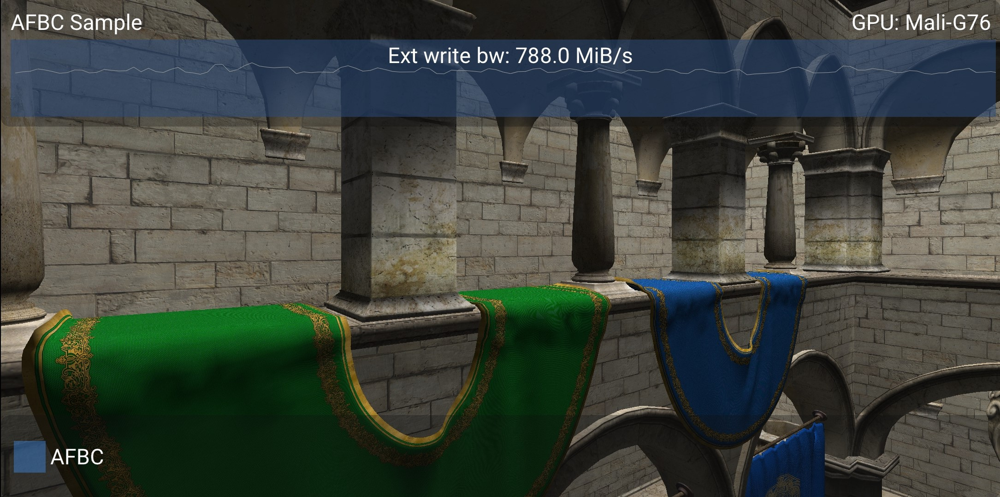
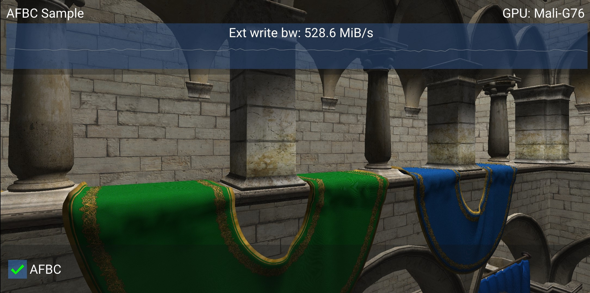
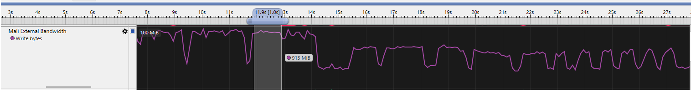
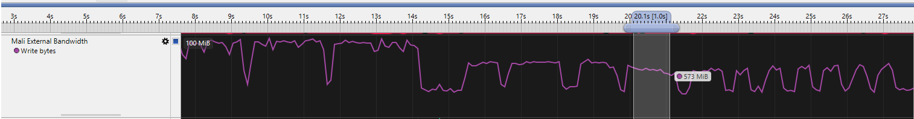

<!--
- Copyright (c) 2019, Arm Limited and Contributors
-
- SPDX-License-Identifier: MIT
-
- Permission is hereby granted, free of charge,
- to any person obtaining a copy of this software and associated documentation files (the "Software"),
- to deal in the Software without restriction, including without limitation the rights to
- use, copy, modify, merge, publish, distribute, sublicense, and/or sell copies of the Software,
- and to permit persons to whom the Software is furnished to do so, subject to the following conditions:
-
- The above copyright notice and this permission notice shall be included in all copies or substantial portions of the Software.
-
- THE SOFTWARE IS PROVIDED "AS IS", WITHOUT WARRANTY OF ANY KIND, EXPRESS OR IMPLIED,
- INCLUDING BUT NOT LIMITED TO THE WARRANTIES OF MERCHANTABILITY,
- FITNESS FOR A PARTICULAR PURPOSE AND NONINFRINGEMENT.
- IN NO EVENT SHALL THE AUTHORS OR COPYRIGHT HOLDERS BE LIABLE FOR ANY CLAIM, DAMAGES OR OTHER LIABILITY,
- WHETHER IN AN ACTION OF CONTRACT, TORT OR OTHERWISE, ARISING FROM,
- OUT OF OR IN CONNECTION WITH THE SOFTWARE OR THE USE OR OTHER DEALINGS IN THE SOFTWARE.
-
-->

# Enabling AFBC in your Vulkan Application

## Overview

AFBC (Arm Frame Buffer Compression) is a real-time lossless compression algorithm, designed to tackle the ever-growing demand for higher resolution graphics. This format is applied to the framebuffers that are to be written to the GPU. This technology can offer bandwidth reductions of [up to 50%](https://developer.arm.com/technologies/graphics-technologies/arm-frame-buffer-compression).

The sample is geared towards demonstrating the bandwidth that you can save by toggling AFBC on and off and displaying a real-time graph of the external bandwidth. In this case we will be focusing on the swapchain images.

The Vulkan API allows the developer a level of control around how the `VkSwapchainKHR` is created and formatted. It is here where we want to ensure that it is created and formatted in the right way so that the subsequent `VkImage`'s that we query from it have AFBC appropriately applied.

It is important to note that from a device perspective to have AFBC enabled on Vulkan, you will need at least driver version `r16p0` and a `Mali G-51` or higher. To find out your GPU and driver version, open Google Chrome on your device and type in `chrome://gpu` and look under the `GL_RENDERER` and `GL_VERSION` information.

## Enabling AFBC

AFBC is functionally transparent to the application and will be automatically applied on a per `VkImage` basis (provided multiple checks pass on various properties of your device and your images).

The driver will check the applications state along with the `VkImage` properties to determine if it will enable AFBC or just continue without it. 
This section will detail the requirements.

`VkImage` requirements:

* `VkSampleCountFlagBits` must be `VK_SAMPLE_COUNT_1_BIT`
* `VkImageType` must be `VK_IMAGE_TYPE_2D`
* `VkImageTiling` must be `VK_IMAGE_TILING_OPTIMAL`
* `VkFormat` must be `VK_FORMAT_R8G8B8A8_UNORM`

In addition to this, your `VkImage` needs to adhere to the following flags:
* `VkImageUsageFlags` must not contain:
  * `VK_IMAGE_USAGE_STORAGE_BIT`
  * `VK_IMAGE_USAGE_TRANSIENT_ATTACHMENT_BIT`
* `VkImageCreateFlags` must not contain:
  * `VK_IMAGE_CREATE_ALIAS_BIT`
  * `VK_IMAGE_CREATE_MUTABLE_FORMAT_BIT`

## The AFBC Sample

The sample presents the user with Sponza, with a graph displaying bandwidth at the top and a configuration window at the bottom. 

The configuration itself is simple. There is one checkbox (labelled "AFBC") that will reload the swapchain when its value is changed.

Here the sample is in its default state: AFBC off. At the top of the screen there is a graph displaying the external write bandwidth (measured from `L2_EXT_WRITE_BEATS`).

It is currently setting the `VK_IMAGE_USAGE_STORAGE_BIT` flag in the `VkImageUsageFlags` for the swapchain images, causing the driver to skip over applying AFBC to the swapchain images.

When we enable the check box, the sample will reload the swapchain with the right usage flags to have the driver enable AFBC. 

Here is the same scene as before, except AFBC is now enabled. The `VK_IMAGE_USAGE_STORAGE_BIT` flag is not being set and the swapchain is being created properly.

 The bandwidth has dropped from 788.0 MiB/s to 528.6 MiB/s, this is approximately a 33% reduction.

You can also confirm these numbers in Streamline. Here are some screenshots:

## Best practice summary

**Do**
* Ensure that your swapchain is created correctly as per the requirements of AFBC.
* Ensure that all textures are compressed into ASTC format.
* Avoid changing your image configuration at run-time (using `vkCmdCopyImage` with an invalid AFBC requirement) as it will trigger a decompression.
* Make sure you are resolving your images using `pResolveAttachments` when it comes to multisampling. Any `VkImage` with `SAMPLE_COUNT > 1` will not have AFBC applied to it.

**Don't**
* Use image usage flags, such as `VK_IMAGE_USAGE_STORAGE_BIT`, unless you really need it (i.e. for compute on a specific image).

**Impact**
* Having an incorrect configuration of your images will cause all your surface `VkImage`'s to be uncompressed, losing out on considerable system wide bandwidth reductions.

**Debugging**
* To test if AFBC is enabled or disabled, you can use a profiler such as Streamline and record the bandwidth values of when AFBC is enabled or when AFBC is disabled.