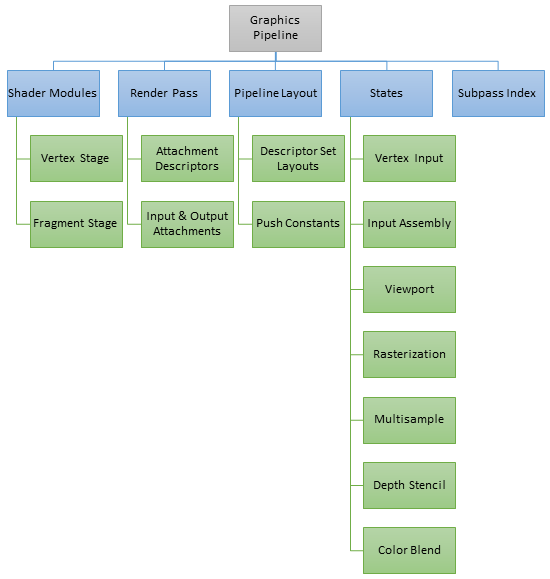
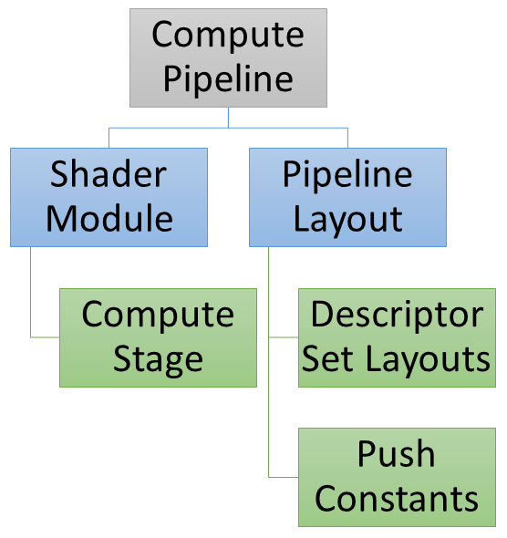
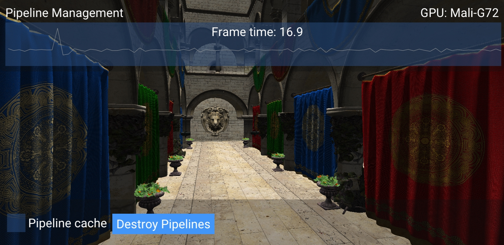

<!--
- Copyright (c) 2019, Arm Limited and Contributors
-
- SPDX-License-Identifier: MIT
-
- Permission is hereby granted, free of charge,
- to any person obtaining a copy of this software and associated documentation files (the "Software"),
- to deal in the Software without restriction, including without limitation the rights to
- use, copy, modify, merge, publish, distribute, sublicense, and/or sell copies of the Software,
- and to permit persons to whom the Software is furnished to do so, subject to the following conditions:
-
- The above copyright notice and this permission notice shall be included in all copies or substantial portions of the Software.
-
- THE SOFTWARE IS PROVIDED "AS IS", WITHOUT WARRANTY OF ANY KIND, EXPRESS OR IMPLIED,
- INCLUDING BUT NOT LIMITED TO THE WARRANTIES OF MERCHANTABILITY,
- FITNESS FOR A PARTICULAR PURPOSE AND NONINFRINGEMENT.
- IN NO EVENT SHALL THE AUTHORS OR COPYRIGHT HOLDERS BE LIABLE FOR ANY CLAIM, DAMAGES OR OTHER LIABILITY,
- WHETHER IN AN ACTION OF CONTRACT, TORT OR OTHERWISE, ARISING FROM,
- OUT OF OR IN CONNECTION WITH THE SOFTWARE OR THE USE OR OTHER DEALINGS IN THE SOFTWARE.
-
-->

# Pipeline Management

## Overview

Vulkan gives applications the ability to save internal representation of a pipeline (graphics or compute) to allow recreating the same pipeline later. This sample will look in detail at the implementation and performance implications of the pipeline creation, caching and management.

## Vulkan Pipeline

To create a graphics pipeline in Vulkan, the following objects are required:

* VkShaderModule (Vertex and Fragment stages)
* VkRenderPass
* Subpass Index
* VkPipelineLayout
  * PushConstants
  * DescriptorSetLayouts
* Pipeline States
  * Vertex Input
  * Input Assembly
  * Rasterizer
  * Depth Stencil
  * Color Blend

Alternatively for a compute pipeline in Vulkan, you need:

* VkShaderModule (Compute stage)
* VkPipelineLayout
  * PushConstants
  * DescriptorSetLayouts

## Vulkan Pipeline Cache

Creating a Vulkan pipeline requires compiling `VkShaderModule` internally. This will have a significant increase in frame time if performed at runtime. To reduce this time, you can provide a previously initialised `VkPipelineCache` object when calling the `VkCreateGraphicsPipelines` or `VkCreateComputePipelines` functions. This object behaves like a cache container which stores the pipeline internal representation for reuse. In order to benefit from using a `VkPipelineCache` object, the data recorded during pipeline creation needs to be saved to disk and reused between application runs.

Vulkan allows an application to obtain the binary data of a `VkPipelineCache` object and save it to a file on disk before terminating the application. This operation can be achieved using two calls to the `vkGetPipelineCacheData` function to obtain the size and `VkPipelineCache` object's binary data. In the next application run, the `VkPipelineCache` can be initialised with the previous run's data. This will allow the `VkCreateGraphicsPipelines` or `VkCreateComputePipelines` functions to reuse the baked state and avoid repeating costly operations such as shader compilation.

## Resource Cache Warmup

A graphics pipeline needs information from the render pass, render state, mesh data and shaders. This makes it harder for a game engine to prepare the Vulkan pipeline upfront because rendering is controlled by game logic. Vulkan tutorials typically show pipelines being built upfront because their state is known. This can also be achieved in a game engine by recording the pipelines created during a game run and then using the information to warmup the internal resource cache in subsequent runs of the game.

In order for this system to work, resource management must be done to track the state of all the Vulkan objects required for pipeline creation and cache them for later reuse. This process is usually done by hashing the input data (`CreateInfo` structure members) used to create the Vulkan objects. This enables a future similar request to return immediately with the cached object. The mapping between input data and the Vulkan object can also alternatively be done by creating the hash using the bitfield hash of the structure members.

While the application is loading, the Vulkan resources can be prepared so that the rendering for the first frames will have minimal CPU impact as all the data necessary has been pre-computed. For example, when the level changes or the game exits, the recorded Vulkan objects can be serialised and written to a file on disk. In the next run the file can be read and deserialised to warmup the internal resource cache.

## The sample

The `pipeline_cache` Vulkan sample demonstrates this behaviour, by allowing you to enable or disable the use of pipeline cache objects. Destroying the existing pipelines will trigger re-caching, which is a process that will slow down the application. In this case there are only 2 pipelines, and the effect is noticeable, therefore we can expect it to have a much greater impact in a real game.

> On the first run of the sample on a device, the first frames will have a slightly bigger execution time because the pipelines are created for the first time - this is expected behaviour. In the next runs of the sample, the `VkPipelineCache` is created with the data saved from the previous run and the internal resource cache.

Below is a screenshot of the sample on a phone with Mali G72 GPU:

Pipeline cache is enabled and Sponza is rendered at 60 FPS when the existing pipelines are destroyed. However, when the pipeline cache is disabled and the existing pipelines are destroyed, a spike in the framerate graph can be noticed.

Building pipelines dynamically without a pipeline cache can result in a sudden framerate drop.

## Best practices summary

**Do**

* Create known pipelines early in the application execution (use data between application runs).
* Use pipeline cache to reduce pipeline creation cost.

**Don't**

* Create pipelines at draw time without a pipeline cache (introduces performance stutters).
* Use pipeline derivatives as they are not supported.

**Impact**

* Increased frame time execution if a pipeline baked state is not reused. The driver then needs to rebuild the pipeline which includes shader compilation, an expensive operation.

**Debugging**

* A frame capture would show if there are any calls to `vkCreateGraphicsPipelines` or `VkCreateComputePipelines` with an empty `VkPipelineCache` object. 

> Due to how `RenderDoc` captures and replays a frame, the field for `VkPipelineCache` is always empty in the report for the 'create pipeline' functions.